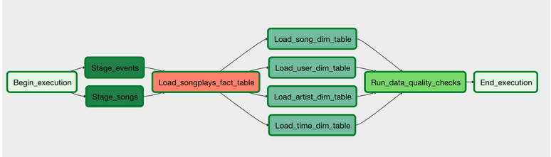
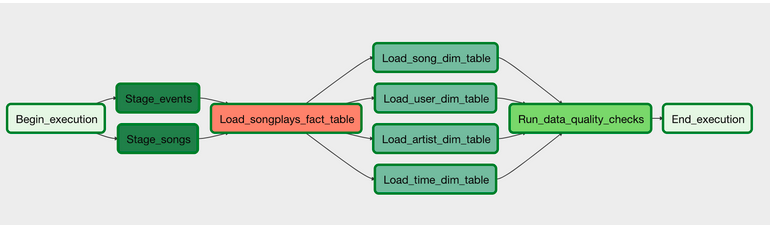

# Data Pipelines with Airflow

In this project, automation and monitoring of data warehouse ETL pipelines is achieved by using Apache Airflow.

The idea is to create high grade data pipelines that are dynamic and built from reusable tasks, can be monitored, and allow easy backfills. Since the data quality plays a big part when analyses are executed on top the data warehouse and want to run tests against their datasets after the ETL steps have been executed to catch any discrepancies in the datasets.

The source data resides in S3 and needs to be processed in Sparkify's data warehouse in Amazon Redshift. The source datasets consist of JSON logs that tell about user activity in the application and JSON metadata about the songs the users listen to.

# Project overview

In this project, custom operators in airflow are created to perform tasks such as staging the data, filling the data warehouse, and running checks on the data as the final step.

The schematic of the project is shown below:

We want to achieve the folling workflow:
